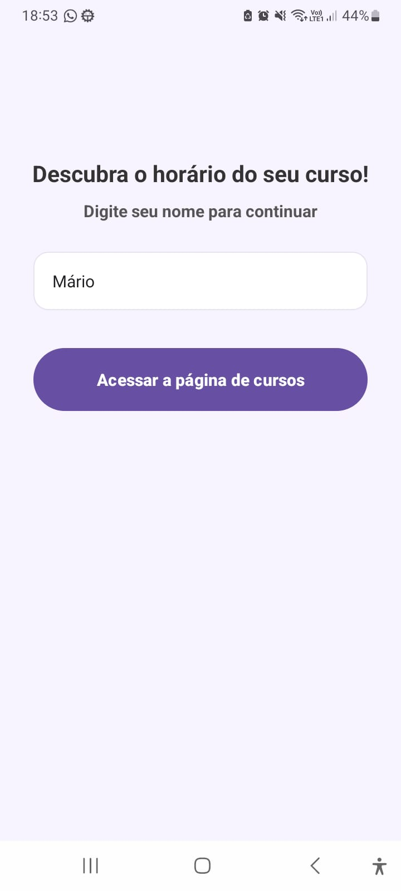
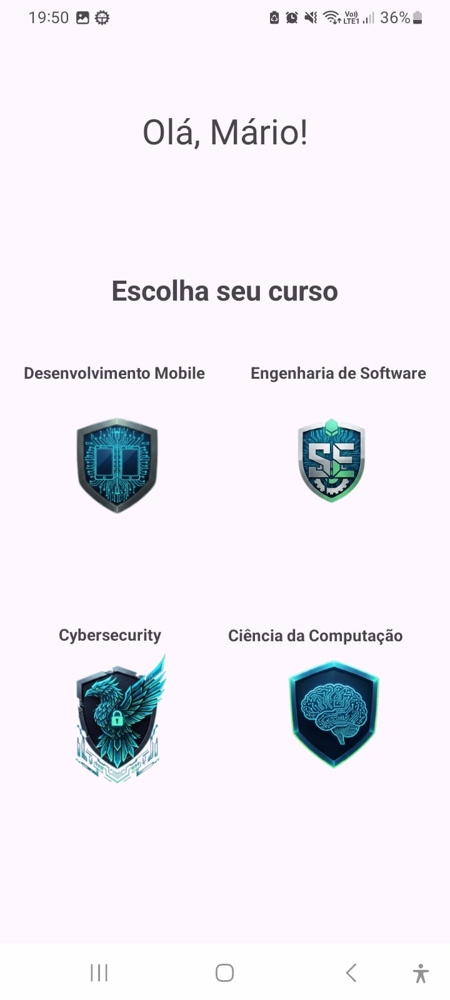
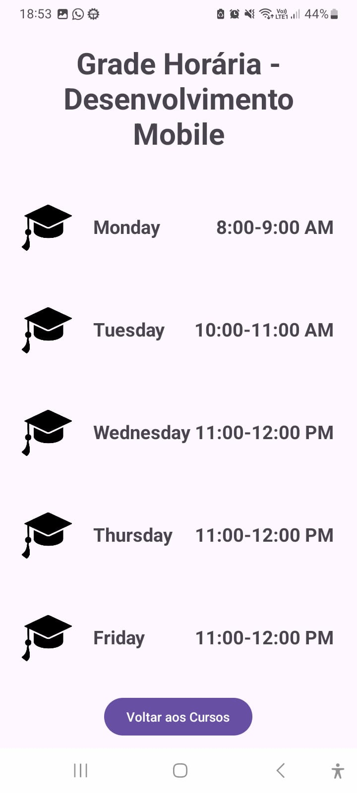
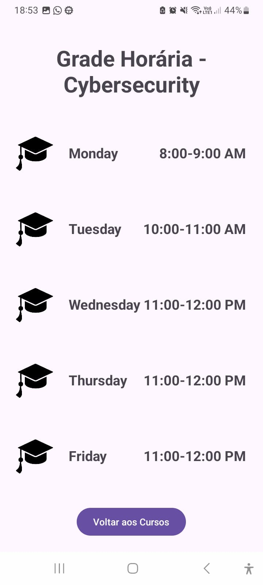
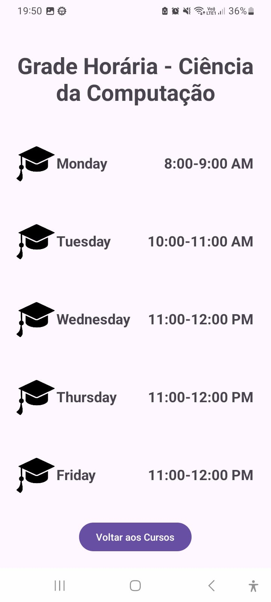
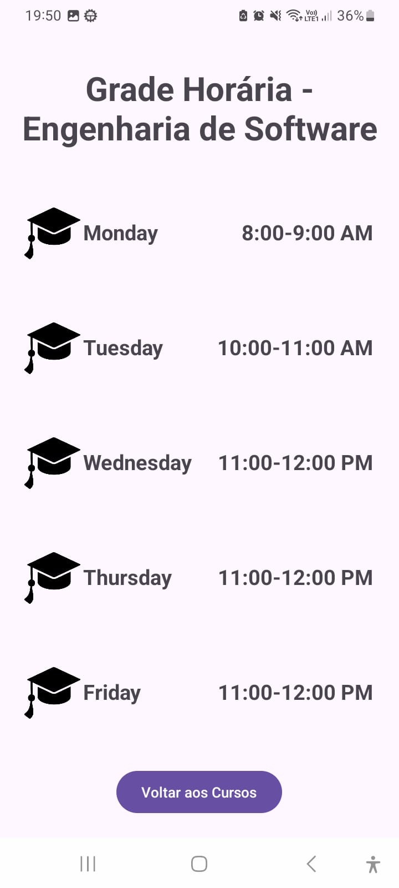

# 📚 HoráriosAula - Aplicativo

Um aplicativo simples e intuitivo desenvolvido para que os alunos possam visualizar facilmente a grade horária dos seus respectivos cursos.

## 🎯 Funcionalidades

- ✏️ **Entrada Personalizada**: Permite que o aluno insira seu nome na tela inicial.
- 📚 **Seleção de Curso**: Interface clara com quatro opções de curso.
- 🕐 **Visualização de Horários**: Grade horária organizada por dias da semana.
- 🔄 **Navegação Simples**: Botão "Voltar aos Cursos" em todas as telas de horário.

## 🛠️ Tecnologias

- Interface desenvolvida com **XML Files e Relative Layout**
- Estrutura de navegação simples
- Design intuitivo

## 📱 Telas do Aplicativo

### 1. **Tela Inicial** 
- Solicita que o usuário insira seu nome
- Apresenta um botão "Acessar a página de cursos"

### 2. **Tela de Cursos** 
- Exibe os quatro cursos disponíveis:
  - **Desenvolvimento Mobile**
  - **Engenharia de Software**
  - **Cybersecurity**
  - **Ciência da Computação**

### 3. **Telas de Grade Horária**
Cada curso possui sua própria tela com a grade horária semanal:

**Horários Padrão:**
- Segunda-feira: 8:00-9:00 AM
- Terça-feira: 10:00-11:00 AM
- Quarta a sexta: 11:00-12:00 PM

## 🚀 Como Usar

1. Acesse a tela inicial
2. Digite seu nome
3. Clique em "Acessar a página de cursos"
4. Selecione seu curso
5. Visualize a grade horária semanal
6. Use "Voltar aos Cursos" para selecionar outro curso

## Imagens App
Página Inicial -

Página de Cursos -

Grade Horária - Mobile

Grade Horária - Cybersecurity

Grade Horária - Ciência da Computação

Grade Horária - Engenharia de Software

## Resultado:

https://github.com/user-attachments/assets/7fe8cab1-100e-43b9-b90c-b30138b26106

## Autores 🙋

**Desenvolvido por:** **Mário Ribeiro**, James Ventura, Ana Clara Cavalcante, Matheus Sabino e Julia Ribeiro

**Repositório:** [github.com/Marioribeir0/HorarioAula](https://github.com/Marioribeir0/HorarioAula.git)
